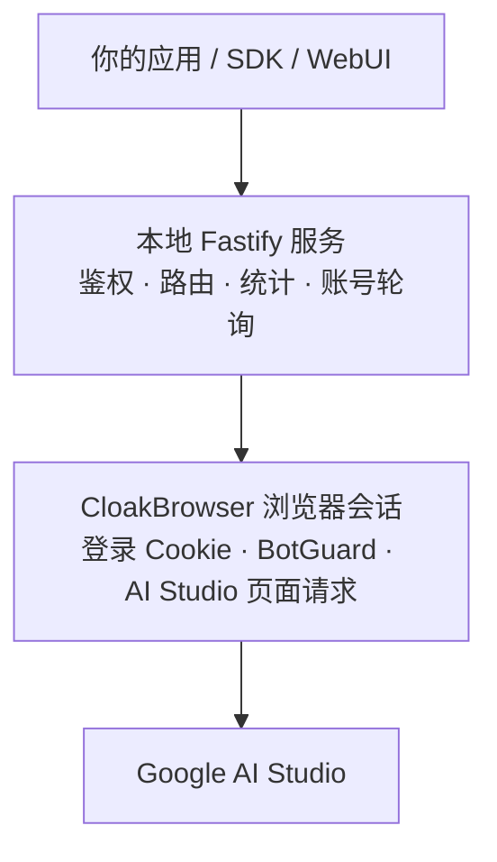

<div align="center">


# aistudio-web-api

**只通过 Google AI Studio 网页会话，为自托管应用提供可调用的 Gemini API 服务。**

TypeScript · Fastify · CloakBrowser —— 把已登录的 AI Studio 账号封装成 Gemini 原生 `generateContent` API，并附带一套适配桌面端与移动端的 WebUI。

Ciallo～(∠・ω< )⌒☆

<p>
  
  &nbsp;
  
  &nbsp;
  
  &nbsp;
  
  &nbsp;
  
</p>

**[English](./README_EN.md)** · [中文](./README.md)

</div>

---

<p align="center">
  <a href="#project-position">项目定位</a> ·
  <a href="#feature-list">功能特性</a> ·
  <a href="#prerequisites">运行前提</a> ·
  <a href="#quick-start">快速开始</a> ·
  <a href="#first-login">首次登录</a> ·
  <a href="#authentication">鉴权</a> ·
  <a href="#api-usage">API 用法</a> ·
  <a href="#webui">WebUI</a> ·
  <a href="#account-rotation">账号轮询</a> ·
  <a href="#configuration">配置</a> ·
  <a href="#docker-deployment">Docker 部署</a> ·
  <a href="#faq">常见问题</a>
</p>

---

<a id="project-position"></a>
## 🎯 项目定位

本项目把 **Google AI Studio 网页版**转换成一个可自托管的 API 服务——无需官方 API Key，登录即用。



> [!IMPORTANT]
> 模型目录和生成请求都通过已登录的 Google AI Studio 浏览器会话执行，请只使用你有权使用的 Google 账号和网络环境。
>
> 本项目提供 Gemini 原生生成接口、多模态输入、工具调用、多账号轮询和 WebUI；模型访问凭据由 AI Studio 登录会话提供。

---

<a id="feature-list"></a>
## ✨ 功能特性

| | 能力 | 说明 |
| :---: | --- | --- |
| ⚡ | **Gemini 原生接口** | `generateContent` 非流式、`streamGenerateContent` SSE 流式、`countTokens` 权威 token 计数 |
| 🤝 | **OpenAI 兼容接口** | `/v1/chat/completions` 非流式与 SSE 流式（`data: [DONE]` 收尾）及 `/v1/models`，OpenAI SDK / One-API / New-API 可直接对接 |
| 🖼️ | **多模态输入** | 图片、音频、视频、PDF、文本和常见代码文件；支持 `inlineData` 与 Google Files `fileData` |
| 🛠️ | **原生工具** | WebUI 可使用 Google 搜索、代码执行、Google Maps、URL Context；API 支持完整的原生 Function Calling 链路（声明 → `functionCall` → 客户端执行 → `functionResponse` 回传 → 最终回答） |
| 🧠 | **思考与统计** | 思考摘要、SSE 增量、token 用量和按模型统计 |
| 🔁 | **多账号轮询** | `round_robin`、`lru`、`least_rl`；429 自动冷却切换，403 无权限的 账号×模型 组合长效跳过 |
| 🖥️ | **WebUI** | 对话、历史、账号、API 密钥、统计和服务设置，适配桌面端与移动端 |
| 🛡️ | **安全转发** | CloakBrowser 管理浏览器会话，HTTP 层支持本地 API Key 鉴权 |
| 🧰 | **可靠性** | 流式请求网络级失败自动重试、浏览器空闲自动关闭与启动看门狗、坏模板自愈 |
| 🐳 | **Docker 部署** | 多阶段镜像内置前端构建、后端编译与 CloakBrowser Chromium，数据卷持久化 |

---

<a id="prerequisites"></a>
## 📋 运行前提

- [Node.js](https://nodejs.org/) 22 或兼容版本
- [pnpm](https://pnpm.io/) 11
- 一个可以正常访问 [Google AI Studio](https://aistudio.google.com/) 的 Google 账号
- 本机登录、远程辅助登录或 Cookie 导入方式三选一
- 如果部署在局域网或公网，建议配置 API Key 并使用 HTTPS 反向代理
- 不想本地装 Node.js/pnpm 也可以直接使用 [Docker 部署](#docker-deployment)

---

<a id="quick-start"></a>
## 🚀 快速开始

```bash
# 1. 克隆项目并进入目录
git clone https://github.com/gaoao-3/aistudio-api.git
cd aistudio-api

# 2. 安装前后端依赖
pnpm run setup

# 3. 可选：复制环境变量示例
cp .env.example .env

# 4. 构建前端静态资源和 TypeScript 后端
pnpm run build

# 5. 启动服务，默认监听 0.0.0.0:3006
pnpm start:fast
```

启动后访问：<http://localhost:3006/>

Windows PowerShell 可以使用：

```powershell
Copy-Item .env.example .env
pnpm run build
pnpm start:fast
```

> [!TIP]
> 只修改后端时可以运行 `pnpm start`，它会重新编译 backend-ts；修改前端后仍需重新执行根目录的 `pnpm run build`。

### 运行目录

默认情况下，账号、Cookie、API 密钥、统计和 `.env` 位于项目目录的 `data/` 及配置文件中。也可以把运行数据放到其他目录：

```powershell
powershell -File backend-ts/start.ps1 `
  -RuntimeRoot "D:/path/to/aistudio-runtime" `
  -Port 3006 `
  -SkipBuild
```

或者在 `.env` 中设置：

```dotenv
AISTUDIO_RUNTIME_ROOT=D:/path/to/aistudio-runtime
```

---

<a id="first-login"></a>
## 🔑 首次登录

启动后按以下顺序操作：

1. 打开 WebUI 的「账号」页面。
2. 选择本机登录、远程辅助登录，或导入 Google Cookie。
3. 激活一个能正常访问 AI Studio 的账号。
4. 回到「对话」页面，选择模型并开始请求。

服务会在托管浏览器中复用登录状态。请求 `/v1/models` 或 `/v1beta/models` 时，浏览器会从 AI Studio 页面取得页面内部凭据，再读取面板模型目录；服务不会要求用户填写 Google Gemini API Key。

> [!WARNING]
> 远程辅助登录必须先配置本地 API Key。密码和验证码只在一次性登录会话中转发，不会写入项目文件、日志或账号资料。

---

<a id="authentication"></a>
## 🔐 鉴权

未配置 API Key 时，接口默认不要求鉴权，适合本机临时使用。配置 `AISTUDIO_API_KEY` 或 `AISTUDIO_API_KEYS` 后，可以使用以下任一形式：

```text
Authorization: Bearer <key>
x-api-key: <key>
x-goog-api-key: <key>
?key=<key>
```

也可以在 WebUI 的「API 密钥」页面创建和删除密钥。API 密钥只用于本地接口鉴权；Google 搜索、代码执行、Google Maps、URL Context 等内置原生工具仅供 WebUI 会话使用。

> [!NOTE]
> `AISTUDIO_API_KEY` / `AISTUDIO_API_KEYS` 是保护本项目 HTTP 接口的**本地服务密钥**，不是 Google Gemini API Key，也不参与 AI Studio 模型请求。

> [!WARNING]
> 完整密钥只在创建时显示一次。不要提交 `.env`、`data/accounts`、`data/apikeys.json` 或包含运行日志的目录。

API 请求中的内置原生工具声明会被移除，不会发送到 AI Studio；本地自定义函数声明会保留，客户端负责执行函数并通过 `functionResponse` 回传。内置原生工具不会通过 API 密钥授权或配置。

---

<a id="api-usage"></a>
## 📚 API 用法

> [!NOTE]
> 所有 Gemini 路由同时提供 `/v1` 和 `/v1beta` 两个版本前缀，下表以 `/v1beta` 为例。

### 常用路由

| 方法 | 路径 | 说明 |
| :---: | --- | --- |
| `GET` | `/health` | 服务健康检查 |
| `GET` | `/auth/check` | 鉴权状态和运行能力 |
| `GET` | `/v1beta/models` | AI Studio 实时模型目录（约每 15 分钟自动刷新）；失败时使用上次同步快照或内置兜底目录 |
| `GET` | `/v1beta/models/{model}` | 查询单个模型 |
| `POST` | `/v1beta/models/{model}:generateContent` | Gemini 原生非流式生成 |
| `POST` | `/v1beta/models/{model}:streamGenerateContent` | Gemini 原生 SSE 流式生成 |
| `POST` | `/v1beta/models/{model}:countTokens` | 权威 token 计数，返回 `{"totalTokens": N}` |
| `GET` | `/v1/models` | OpenAI 兼容模型列表（`object: "list"`） |
| `POST` | `/v1/chat/completions` | OpenAI 兼容对话补全（非流式 + SSE 流式） |
| `GET` / `POST` / `PUT` / `DELETE` | `/api-keys` | 创建、查看、更新权限和删除本地服务密钥 |
| `GET` | `/stats` | 用量统计 |
| `GET` / `PUT` | `/config/runtime` | 运行时配置 |
| `GET` / `POST` | `/rotation` 相关接口 | 账号轮询状态和切换 |

### 读取模型目录

```bash
curl http://localhost:3006/v1beta/models
```

开启本地鉴权时：

```bash
curl http://localhost:3006/v1beta/models \
  -H "Authorization: Bearer <AISTUDIO_API_KEY>"
```

响应中的 `source` 有三种值：

- `live`：从已登录的 AI Studio 面板读取成功，并写入 `data/model-catalog.json`。
- `snapshot`：实时读取失败，使用上次成功同步的模型目录快照。
- `fallback`：没有可用快照时，浏览器未登录、Cookie 失效、页面协议变化或网络失败，暂时使用内置目录。

服务端模型目录缓存 15 分钟；WebUI 保持打开时也会每 15 分钟重新请求一次。快照只保存模型元数据，不包含登录凭据。

### Gemini 原生生成

普通生成：

```bash
curl http://localhost:3006/v1beta/models/gemini-3.8-flash:generateContent \
  -H "Content-Type: application/json" \
  -d '{
    "contents": [{
      "role": "user",
      "parts": [{"text": "你好，请介绍一下你自己。"}]
    }]
  }'
```

流式生成：

```bash
curl http://localhost:3006/v1beta/models/gemini-3.8-flash:streamGenerateContent \
  -H "Content-Type: application/json" \
  -d '{
    "contents": [{
      "role": "user",
      "parts": [{"text": "请分三步解释这个问题。"}]
    }]
  }'
```

流式响应遵循 Gemini SSE 格式，每个 `data:` 行都是一个 JSON 响应块；服务不会发送 `[DONE]`，客户端应以连接自然结束作为完成信号。

Token 计数（权威 CountTokens RPC，不消耗生成配额）：

```bash
curl http://localhost:3006/v1beta/models/gemini-3.8-flash:countTokens \
  -H "Content-Type: application/json" \
  -d '{"contents": [{"role": "user", "parts": [{"text": "你好"}]}]}'
# => {"totalTokens": 2}
```

> [!NOTE]
> `generationConfig` 会按 ListModels 实时目录校验：`maxOutputTokens` 超过模型上限、非法 `temperature`/`topP`/`topK` 范围、模型不支持的 `thinkingLevel` 都会直接返回 400；目录暂不可用时仅校验协议级范围。

多模态内容使用 Gemini 原生格式，例如：

```json
{
  "contents": [{
    "role": "user",
    "parts": [
      { "text": "请总结这个 PDF。" },
      { "inlineData": { "mimeType": "application/pdf", "data": "JVBERi0x..." } }
    ]
  }]
}
```

已有 Google Files 可以使用 `fileData`：

```json
{
  "contents": [{
    "role": "user",
    "parts": [{
      "fileData": {
        "mimeType": "application/pdf",
        "fileUri": "https://generativelanguage.googleapis.com/v1beta/files/FILE_ID"
      }
    }]
  }]
}
```

### 原生请求与工具调用

原生接口使用 Google Gemini 的 `contents` / `parts` 格式，支持文本、多模态输入、思考、结构化输出、Google 搜索、代码执行、Maps、URL Context 和自定义函数声明。

Gemini 3 的无状态多轮请求必须保留模型返回的 `thought` 部分及 `thoughtSignature`；函数调用结果使用标准 `functionResponse` 回传，服务会自动携带首轮的 `responseId` 并固定到原账号完成原生续接。

> [!IMPORTANT]
> 服务不会把被上游拒绝的工具结果改写成文本重放，也不会为上游空响应自动补写提示词；上游返回带有终止原因（例如安全拦截）的空候选时保留原始 `finishReason`，只有无法解析且没有终止原因的空响应才返回 `502`，便于按原始请求排查。

#### Function Calling 完整往返

**① 第一轮：发送用户消息 + 函数声明**

```json
{
  "contents": [{ "role": "user", "parts": [{ "text": "北京天气" }] }],
  "tools": [{ "functionDeclarations": [{
    "name": "getWeather",
    "description": "gets the weather for a requested city",
    "parameters": { "type": "object", "properties": { "city": { "type": "string" } }, "required": ["city"] }
  }] }]
}
```

响应 `candidates[0].content.parts[0]` 返回函数调用：

```json
{
  "functionCall": { "name": "getWeather", "args": { "city": "北京" }, "id": "call_xxx" },
  "thoughtSignature": "..."
}
```

**② 第二轮：客户端执行函数后回传结果**

原样回带第一轮返回的 model part（含 `thoughtSignature`），并附加 `functionResponse`：

```json
{
  "contents": [
    { "role": "user", "parts": [{ "text": "北京天气" }] },
    { "role": "model", "parts": [{
      "functionCall": { "name": "getWeather", "args": { "city": "北京" }, "id": "call_xxx" },
      "thoughtSignature": "..."
    }] },
    { "role": "user", "parts": [{
      "functionResponse": { "name": "getWeather", "id": "call_xxx", "response": { "response": "23°C" } }
    }] }
  ],
  "tools": [{ "functionDeclarations": ["与第一轮相同的函数声明"] }]
}
```

响应返回最终回答：`"北京现在的天气是 23°C。"`

> [!TIP]
> 第二轮不需要手动传 `responseId`——服务按 `functionResponse.id` 匹配首轮调用并自动补齐续接字段；标量结果需包装为 `{ "response": "<值>" }`，对象结果直接作为 `response` 内容。

---

### OpenAI 兼容接口

服务同时暴露 OpenAI 协议端点（参考 AIStudio2API 的适配方式），可直接接入 OpenAI SDK、One-API、New-API 等生态：

| 方法 | 路径 | 说明 |
| :---: | --- | --- |
| `GET` | `/v1/models` | 模型列表，返回 `{"object": "list", "data": [...]}` |
| `POST` | `/v1/chat/completions` | 对话补全；`"stream": true` 时返回 SSE `chat.completion.chunk` 帧并以 `data: [DONE]` 结束 |

非流式调用：

```bash
curl http://localhost:3006/v1/chat/completions \
  -H "Content-Type: application/json" \
  -H "Authorization: Bearer <AISTUDIO_API_KEY>" \
  -d '{
    "model": "gemini-3.8-flash",
    "messages": [{"role": "user", "content": "你好"}],
    "temperature": 0.7,
    "max_tokens": 1024
  }'
```

流式调用（SDK 用法，`base_url` 指向本服务即可）：

```python
from openai import OpenAI

client = OpenAI(api_key="<AISTUDIO_API_KEY>", base_url="http://localhost:3006/v1")
stream = client.chat.completions.create(
    model="gemini-3.8-flash",
    messages=[{"role": "user", "content": "你好"}],
    stream=True,
    stream_options={"include_usage": True},
)
for chunk in stream:
    print(chunk.choices[0].delta.content or "", end="")
```

已支持的请求字段：

- `messages`：`system`/`developer`、`user`（文本、`image_url` data URI、`file` data URI）、`assistant`（含 `tool_calls`）、`tool` 结果回传（按 `tool_call_id` 匹配函数名）。
- 采样与输出：`temperature`、`top_p`、`top_k`、`max_tokens`/`max_completion_tokens`、`stop`、`response_format`（`json_object` / `json_schema`）、`reasoning_effort`（映射为 Gemini thinkingLevel）。
- 工具：`tools`（function 声明）、`tool_choice`（`auto`/`none`/`required`/指定函数）。
- 流式：`stream`、`stream_options.include_usage`（末帧携带 `usage`）。
- Gemini 3 工具调用会在 `tool_calls[].extra_content.google.thought_signature` 中返回思考签名；客户端必须在下一轮请求中原样保留该字段。

说明：思考内容以 `reasoning_content` 字段返回（流式为增量帧）；错误统一返回 OpenAI 风格 `{"error": {"message", "type", "code"}}`；鉴权与 Gemini 路由一致（`Authorization: Bearer` 或 `x-api-key`）。远程图片 URL 不支持，请改用 data URI。

---
<a id="webui"></a>
## 🖥️ WebUI

| 页面 | 能力 |
| --- | --- |
| 对话 | 流式输出、思考摘要、Google 搜索、代码执行、Google Maps、URL Context、工具调用卡片、生图和多模态附件 |
| 历史 | 查看和清空当前浏览器本地对话记录 |
| 账号 | 本机登录、远程登录、Cookie 导入、激活、删除和账号资料刷新 |
| API 密钥 | 创建、查看前缀和删除本地服务密钥；密钥仅用于接口鉴权 |
| 统计 | 查看模型请求数、成功率、限流、错误和 token 用量 |
| 服务设置 | 调整请求体上限、浏览器/登录超时、账号轮询和代理 |

附件通过浏览器读取并转换为 base64，不会把手机本地路径发送给后端。当前 WebUI 限制为单文件 15 MiB、总大小 16 MiB；服务默认 JSON 请求体上限为 32 MiB。

---

<a id="account-rotation"></a>
## 🔁 账号轮询

账号页面支持多个 Google 账号。可选策略：

| 策略 | 说明 |
| --- | --- |
| `round_robin` | 按顺序轮换 |
| `lru` | 优先较久未使用的账号 |
| `least_rl` | 优先近期被限流较少的账号 |

**故障转移行为：**

- **429 / 配额限制** → 当前账号进入冷却，剩余重试次数内尝试其他可用账号；失败账号释放后立即后台预热下一个未使用账号，维持双温热池。
- **403（协议 Code 7，无权限）** → 该 账号×模型 组合长效记入 `data/accounts/denied-models.json`，后续调度直接跳过；不影响该账号的其他模型。重新登录、导入 Cookie 或删除账号后自动恢复。
- 非当前激活账号的备用浏览器空闲超过 `AISTUDIO_BROWSER_STANDBY_IDLE_TIMEOUT_MS` 后只关闭上下文，保留 Profile 和 Cookie；再次切换时自动恢复。
- 账号资料刷新是尽力行为，页面结构变化或 Cookie 失效时会保留上一次成功资料。

---

<a id="configuration"></a>
## ⚙️ 配置

配置可以放在运行目录的 `.env` 文件，也可以使用环境变量。完整示例见 [.env.example](./.env.example)。

### 服务与浏览器

| 变量 | 默认值 | 说明 |
| --- | ---: | --- |
| `AISTUDIO_PROJECT_ROOT` | 自动查找 | 项目根目录 |
| `AISTUDIO_RUNTIME_ROOT` | 项目目录 | 账号、状态、统计和 `.env` 所在目录 |
| `AISTUDIO_HOST` | `0.0.0.0` | 监听地址 |
| `AISTUDIO_PORT` | `3006` | 监听端口 |
| `AISTUDIO_API_KEY` / `AISTUDIO_API_KEYS` | 空 | 一个或多个本地 HTTP API Key |
| `AISTUDIO_APIKEYS_FILE` | `data/apikeys.json` | WebUI 创建的密钥存储文件 |
| `AISTUDIO_BROWSER_HEADLESS` | `true` | 是否无头运行 CloakBrowser |
| `AISTUDIO_BROWSER_IDLE_TIMEOUT_MS` | `1800000` | 浏览器连续空闲后自动关闭的毫秒数；`0` 表示禁用 |
| `AISTUDIO_BROWSER_MAX_ALIVE_INSTANCES` | `2` | 双温热池上限；超出时淘汰最久未用账号，`0` 表示不限制 |
| `AISTUDIO_BROWSER_STANDBY_IDLE_TIMEOUT_MS` | `600000` | 非当前账号的备用浏览器空闲回收时间；只关闭浏览器上下文并保留 Profile，`0` 表示禁用 |
| `AISTUDIO_BROWSER_EVICT_GRACE_MS` | `60000` | 超过保活上限后的淘汰宽限期，避免高频切换时反复冷启动 |
| `AISTUDIO_BROWSER_TIMEOUT_MS` | `120000` | 浏览器请求超时，单位毫秒 |
| `AISTUDIO_API_BODY_LIMIT_BYTES` | `33554432` | 请求体上限，默认 32 MiB |
| `AISTUDIO_PROXY_URL` | 系统代理 | 浏览器使用的代理地址 |
| `AISTUDIO_AUTH_FILE` | 自动选择 | Playwright storage state 文件 |

### 登录

| 变量 | 默认值 | 说明 |
| --- | ---: | --- |
| `AISTUDIO_LOGIN_TIMEOUT_MS` | `600000` | 登录流程最长等待时间 |
| `AISTUDIO_LOGIN_SESSION_RETENTION_MS` | `600000` | 已结束登录会话保留时间 |

### 生成响应缓存

默认采用 `deterministic` 策略：仅缓存请求完全相同、`temperature=0`、显式固定 `seed`，且不包含工具、函数调用/结果、外部文件或 Cached Content 的成功响应。`exact` 可恢复旧版"所有无工具精确请求"行为；流式请求命中后返回一个完整响应事件。缓存持久化在 SQLite 中。

| 变量 | 默认值 | 说明 |
| --- | ---: | --- |
| `AISTUDIO_RESPONSE_CACHE_ENABLED` | `true` | 是否启用生成响应缓存 |
| `AISTUDIO_RESPONSE_CACHE_MODE` | `deterministic` | `off` / `deterministic` / `exact` |
| `AISTUDIO_RESPONSE_CACHE_TTL_SECONDS` | `3600` | 缓存有效期；`0` 表示禁用 |
| `AISTUDIO_RESPONSE_CACHE_MAX_BYTES` | `33554432` | 缓存总内存上限 |
| `AISTUDIO_RESPONSE_CACHE_MAX_ENTRY_BYTES` | `1048576` | 单个请求或响应的缓存上限 |

### AI Studio 私有续接

`AISTUDIO_PRIVATE_CONTINUATION` 默认开启。函数调用首轮会暂存 AI Studio 的 `responseId`，函数结果回传时固定到同一账号并写入网页端要求的续接字段；记录只存在内存，绑定账号，不跨账号复用，账号浏览器关闭、Cookie 替换或 TTL 到期后失效。这不是官方 Context Cache，也不会替代完整 `contents`。请求中的 `cachedContent` 会明确返回 400；需要真正的上下文缓存请使用官方 Gemini API。

| 变量 | 默认值 | 说明 |
|---|---:|---|
| `AISTUDIO_PRIVATE_CONTINUATION` | `true` | 函数结果回传时复用首轮 `responseId` 并固定到原账号；关闭后网页端通常会拒绝 `functionResponse` |

### 账号轮询与模型默认值

| 变量 | 默认值 | 说明 |
| --- | ---: | --- |
| `AISTUDIO_ACCOUNTS_DIR` | `data/accounts` | 账号和 Cookie 存储目录 |
| `AISTUDIO_ACCOUNT_ROTATION_MODE` | `round_robin` | `round_robin` / `lru` / `least_rl` |
| `AISTUDIO_ACCOUNT_COOLDOWN_SECONDS` | `60` | 429 或配额错误后的冷却时间 |
| `AISTUDIO_ACCOUNT_MAX_RETRIES` | `3` | 单次请求最多尝试账号数 |
| `AISTUDIO_ACCOUNT_PROFILE_REFRESH_MS` | `21600000` | 账号资料建议刷新间隔 |
| `AISTUDIO_STATS_FILE` | `data/stats.json` | 用量统计文件 |
| `AISTUDIO_MODEL_DEFAULTS_FILE` | `config.yaml` | 模型默认参数 YAML |

> [!NOTE]
> 模型访问使用 AI Studio 账号的浏览器会话；`AISTUDIO_API_KEY` / `AISTUDIO_API_KEYS` 仅用于保护本地 HTTP 服务。

---

<a id="docker-deployment"></a>
## 🐳 Docker 部署

项目提供多阶段 `Dockerfile` 和 `docker-compose.yml`：镜像内完成前端构建、后端编译，并预下载 CloakBrowser 隐身 Chromium，容器首启无需再联网下载浏览器。

```bash
# 构建并启动（数据持久化到 ./data）
docker compose up -d --build

# 查看日志
docker compose logs -f
```

> [!IMPORTANT]
> 容器内浏览器访问 Google 需要代理。注意容器里的 `127.0.0.1` 不是宿主机，请在 `.env` 中把 `AISTUDIO_PROXY_URL` 指向**宿主机局域网 IP** 加端口（并让代理允许局域网连接），或改用 `network_mode: host` 后继续使用 `127.0.0.1`。

首次登录与本地运行一致：打开 `http://<宿主机>:3006` 的「账号」页面完成本机登录、远程辅助登录或 Cookie 导入，账号数据通过 `./data` 卷持久化。

---

## 🛠️ 开发与验证

```bash
# 类型检查
pnpm typecheck

# 后端测试
pnpm test

# 构建前端和后端
pnpm build

# 后端开发模式
pnpm dev:backend

# 前端开发模式
pnpm dev:frontend
```

---

## 🔒 安全说明

- 本项目不会把 Google 密码写入项目文件。
- 账号 Cookie、API 密钥、`.env` 和运行日志都属于敏感数据，请限制文件和端口访问权限。
- 公网部署时请使用 HTTPS 反向代理，并始终启用本地 API Key 鉴权。
- 请遵守 Google AI Studio 的服务条款、账号权限和所在地区网络法规。

---

<a id="faq"></a>
## ❓ 常见问题

**请求时报 `AI Studio streaming request failed: TypeError: Failed to fetch`？**

这是浏览器内 `fetch()` 在拿到响应前失败，常见原因是代理对长连接不稳定、Cookie 过期、账号触发风控或请求模板失效。请按顺序排查：

1. 用服务配置的浏览器配置手动打开 AI Studio，确认已登录且能正常生成内容。
2. 重新登录或导入 Cookie，重启服务让它重新捕获请求模板。
3. 确认代理同时作用于后端启动的浏览器进程，而不只是系统浏览器。
4. 失败集中在长请求时，适当调大 `AISTUDIO_BROWSER_TIMEOUT_MS`。

**模型目录返回 `fallback`？**

说明浏览器未登录、Cookie 失效、页面协议变化或网络失败，服务暂时使用内置目录兜底。实际生成仍需要可用的 AI Studio 登录会话，请先激活账号再发起请求。

**遇到 429 / 配额限制？**

多账号轮询会自动冷却当前账号并切换到其他可用账号；单账号部署时请等待冷却结束或降低请求频率。

---

## 💖 致谢

本项目是在以下开源项目和社区资料基础上持续重写、验证和扩展的，感谢所有维护者与贡献者：

### 上游项目与协议研究

- [chrysoljq/aistudio-api](https://github.com/chrysoljq/aistudio-api) — 本项目早期 Python 版本的上游基础；账号管理、AI Studio 网页网关和部分 WebUI 设计由此开始，后续已逐步重写为 TypeScript。
- [LuanRT/BgUtils](https://github.com/LuanRT/BgUtils) — BotGuard snapshot 的研究与实现资料。
- [iBUHub/AIStudioToAPI](https://github.com/iBUHub/AIStudioToAPI) — AI Studio 网页协议、请求流程和 API 适配的参考实现。
- [Mag1cFall/AIStudio2API](https://github.com/Mag1cFall/AIStudio2API) — OpenAI 兼容适配、AI Studio wire 协议、稀疏 JSON 解析和模型参数默认值的参考实现。
- [CloakHQ/cloakbrowser](https://github.com/CloakHQ/cloakbrowser) — 本项目运行时使用的隐身 Chromium / Playwright 浏览器实现。

### 交互与社区参考

- [QuantumNous/new-api](https://github.com/QuantumNous/new-api) — 请求日志页面呈现方式的参考。
- [linux.do](https://linux.do) — AI Studio 网页协议、模型变化和部署实践的社区讨论与现场资料。

---

## 📄 License

MIT

---

<p align="center">
  <sub>Built with ❤️ & TypeScript · Ciallo～(∠・ω< )⌒☆ · 如果这个项目帮到了你，点个 ⭐ 吧</sub>
</p>
